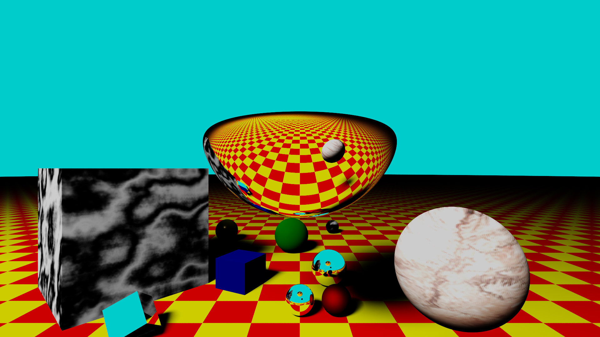

# RayTracerCPU

CPU RAY TRACER realised during the course Introduction to photo-realistic synthesis at the University of Limoges.

This Ray Tracer has the following features :

- Point & Surface Light
- Hard & Soft shadows
- Textures
- AABB & BVH
- Cook-Torrance and Oren-Nayar BRDF
- Reflection & Refraction
- SDF objects

